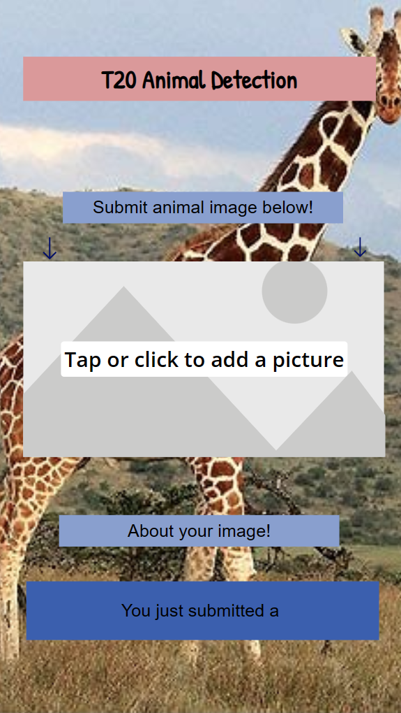
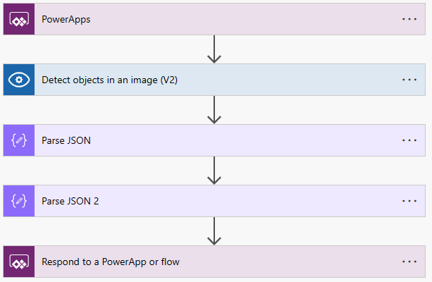

# Animal Detection (T20 Project 2023)

## Introduction
This project aims to detect animal species on the image uploaded by users. Users can upload an image each time on our PowerApp, and they will get the results of what kinds of animals appear on the image after uploading. In this project, we store the training data in the blob storage, modify the data with Azure ML Studio notebook, import images and annotations to Azure Custom Vision, and build a PowerApp for the user interface.

## Architecture Overview
   

   

There are 2 main parts to our architecture: the model training process and the image submission and scoring workflow. 

**Model training:**    

The training images and labels are brought into Blob Storage. The labels are then modified to a suitable format using an Azure Machine Learning notebook and imported into Cognitive Services. The multiple classification model is then trained on Cognitive Services. 

**Image submission and scoring:**  

Users submit images through a PowerApp UI, which sends a call to the previously trained model. The same PowerApp then displays the answer received, which is the name of the animal found within the image. 

## Final Presentation

Find our full final presentation PPT [here](https://microsoft-my.sharepoint.com/:p:/p/aayushimehta/IQGK-2yNJfliR4pt6TAdf-OmAapqmytEqZkPyOEI2KyBdZ4). Or explore the sections below.

 
Objectives and Data Exploration

 
 
 

 
Challenges and Solutions

 <ul>
  <li>

 
Data

 
 

  </li>
  <li>
 

  
AI/Cognitive Service

  
  
  
 

  </li>
  <li>
 

  
PowerApps/Flow

  
 

  </li>
 </ul>

 
Flow Overview

 

 
Conclusion

 
 

## Application
Access and test our PowerApp at [aka.ms/AnimalVision](https://aka.ms/AnimalVision)!

   

 The PowerApp, optimized for mobile devices but also accessible through PCs, presents the users with an image submission box and a result textbox that populates with the model results. When a user submits an image, a flow is triggered, which formats the image for processing, calls the model and obtains the results.  

 **Flow Steps**
 
   
 
There are 4 main steps to the flow:
* Image submission: The submission of an image is reflected by the Image component changing, which triggers the flow and receives the binary file wrapped in a JSON object.
* Image formatting and model call: The image is transformed to the correct format and sent over to the Cognitive Services Custom Vision model.
* Response retrieval: The model's response is received as a JSON array of different detected animals, their bounding boxes and likelihoods. The most likely result is selected.
* Variable return: The selected animal name is returned by the flow and stored in an app variable.

## Project Plan
### Objectives
- Create an app to identify user uploaded wildlife species.
- Train object detection model for animals with Custom Vision in Azure Cognitive Service.
- Build user interface with PowerApp for real-time identification.

### Data Overview
[Animals Detection Images Dataset | Kaggle](https://www.kaggle.com/datasets/antoreepjana/animals-detection-images-dataset)

- The Animal dataset (10GB) contains a train set and a test set. 
- Each image folder is named after the specific animal's category. Images are in .jpg format. 
- Each animal folder has a label folder where the .txt files store location information for the labels.

## Specialities
- Data: Rachel & Melody
- Cognitive Search: Rachel & Melody
- PowerApp: Juan & Aayushi

## Overall Concept
- To use PowerApp, Azure Ml Studio, and Azure Custom Vision to identify an animal species based on an uploaded image.
## Timeline

**First Sprint (April)**
* Topic and dataset selection
* Architecture iteration
* Image tag processing 
* Front-end selection and trials

**Second Sprint (May & June)**
* Model training
* Front end design
* Flow development

**Third Sprint (July)**
* Back end and front end connected
* Testing
* Presentation planning

## References
-Upload annotations to Azure Custom Vision [samples/pylabel2azure_custom_vision.ipynb at main · pylabel-project/samples · GitHub](https://github.com/raccchel/T20_2023Spring/assets/97638746/42bc0f10-5c08-4c5c-8f32-782896f910a9)

-Notebook Data [farm animals detection yolov5](https://www.kaggle.com/code/majdikarim/farm-animals-detection-yolov5)

-Notebook Data [pylabel2azure custom vision](https://github.com/pylabel-project/samples/blob/main/pylabel2azure_custom_vision.ipynb)

