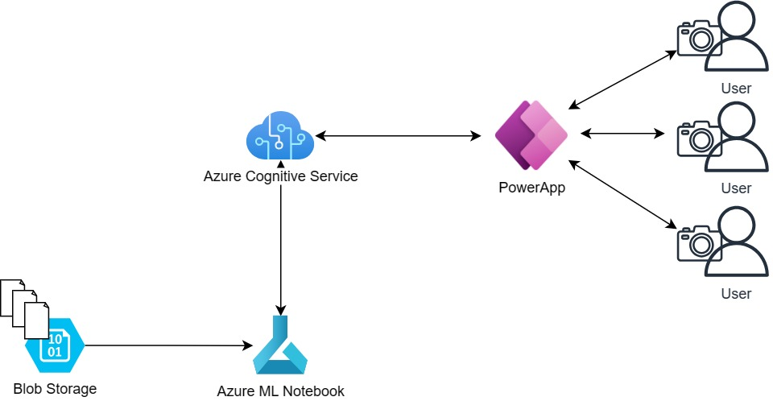

# Animal Detection (T20 Project 2023)

## Introduction

## Architecture Overview
 

There are 2 main parts to our architecture: the model training process and the image submission and scoring workflow. 

Model training:

The training images and labels are brought in to Blob Storage. The labels are then modified to a suitable format using an Azure Machine Learning notebook and imported into Cognitive Services. The multilable classification model is then trained on Cognitive Services. 

Image submission and scoring:

Users submit images through a PowerApp UI, which sends a call to the previously trained model. The same PowerApp then displays the answer received, which is the name of the animal found within the image. 

## Final Presentation

## Application

## Project Plan
### Objectives
- Create an app to identify user uploaded wildlife species.
- Train object detection model for animals with Custom Vision in Azure Cognitive Service.
- Build user interface with PowerApp for real-time identification.

### Data Overview
[Animals Detection Images Dataset | Kaggle](https://www.kaggle.com/datasets/antoreepjana/animals-detection-images-dataset)

- The Animal dataset (10GB) contains a train set and a test set. 
- Each image folder is named after the specific animal's category. Images are in .jpg format. 
- Each animal folder has a label folder where the .txt files store location information for the labels.

## Specialities

## Overall Concept

## Timeline

## References
